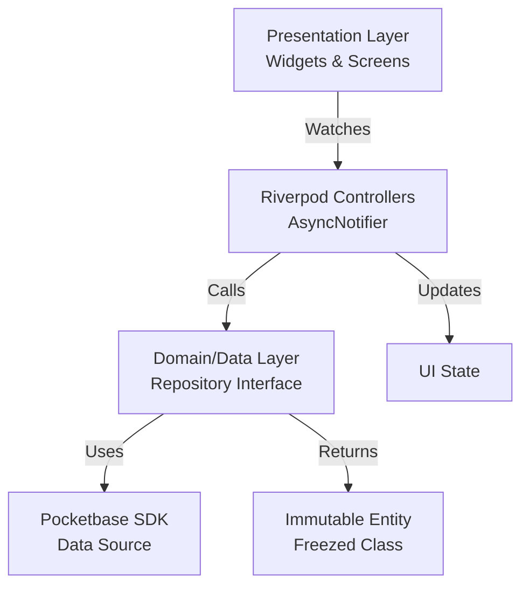

Hier ist das finale, umfassende **Product Requirement Document (PRD)** für "Saisonier". Es dient als "Source of Truth" für Design, Entwicklung und Produktstrategie.

-----

# Product Requirement Document (PRD): Saisonier

**Version:** 1.0.0
**Datum:** 07.12.2025
**Status:** Implementation Done (MVP Completed)
**Markt:** Schweiz (CH)
**Plattform:** iOS / Android (Flutter)

-----

## 1\. Executive Summary

**Saisonier** ist eine visuell getriebene, haptisch ansprechende mobile Applikation, die den klassischen Schweizer Saisonkalender in das digitale Zeitalter überführt. Anstatt statischer Tabellen bietet die App ein immersives Erlebnis ("Tinder für Gemüse"), das Nutzer durch hochwertige Ästhetik zur saisonalen Ernährung inspiriert.
Die App kombiniert eine umfassende Datenbank von über 75 Schweizer Gemüse- und Obstsorten mit kuratierten Rezepten. Technologisch setzt das Projekt auf eine strikte **Clean Architecture** mit Flutter und einem leichtgewichtigen **Pocketbase** Backend, wobei Prinzipien wie KISS (Keep It Simple, Stupid) und Datenschutz (Privacy by Design) im Vordergrund stehen.

-----

## 2\. Produkt-Prinzipien

### 2.1. Design-Philosophie: "Clean Playfulness"

  * **Visuelle Dominanz:** Bilder stehen im Mittelpunkt. Text ist sekundär.
  * **Haptisches Feedback:** Die App fühlt sich "physisch" an. Scrollen, Tappen und Swipen werden durch subtile Vibrationen untermalt.
  * **Adaptive UI:** Die Benutzeroberfläche passt sich farblich dem Inhalt an (z.B. pastellgrüner Hintergrund bei Nüsslisalat).

### 2.2. Technische Philosophie

  * **Clean Architecture:** Klare Trennung von Data, Domain und Presentation Layer (Riverpod Architecture).
  * **Offline First:** Alle statischen Daten (Gemüse-Infos) werden aggressiv gecacht. Die App funktioniert auch im Supermarkt ohne Empfang.
  * **YAGNI (You Ain't Gonna Need It):** Keine überflüssigen Features (wie Social Sharing, Kommentare oder komplexe User-Profile) im MVP.

### 2.3. Lokalisierung

  * **Schweizer Nomenklatur:** Konsequente Nutzung von Schweizer Begriffen (Wirz, Randen, Nüsslisalat, Peperoni) statt bundesdeutscher Bezeichnungen.
  * **Saison-Daten:** Basierend auf Schweizer Anbau-Tabellen (nicht EU-Durchschnitt).

-----

## 3\. Zielgruppen & User Personas

  * **Der visuelle Ästhet:** Sucht Inspiration, hasst langweilige Listen. Entscheidet "mit den Augen".
  * **Der bewusste Einkäufer:** Will nachhaltig einkaufen, weiss aber im Supermarkt oft nicht, was *wirklich* Saison hat.
  * **Der Foodie:** Sucht nach Nischenprodukten (Kardy, Topinambur) und neuen Zubereitungsarten.

-----

## 4\. Funktionale Anforderungen (Features)

### 4.1. Core Navigation (View Switch)

Der Nutzer kann nahtlos zwischen zwei Ansichten wechseln. Der State wird persistiert.

  * **Sliver App Bar:** Beinhaltet Logo und einen Toggle-Switch (Segmented Control).
  * **Toggle Logic:** Umschalten zwischen "Feed" (Inspiration) und "Grid" (Übersicht) ohne Ladezeit.

### 4.2. View A: Der "Seasonal Feed" (Inspiration)

Ein vertikales, bildschirmfüllendes Karussell.

  * **Content:** Zeigt nur Items an, die im *aktuellen Monat* Saison haben.
  * **Sortierung:** Priorisiert "Tier 1 Heroes" (Beliebte Produkte) vor "Tier 4 Basics" (Lagerware).
  * **Interaktion:**
      * Vertikales "Snap"-Scrollen (Page View).
      * Parallax-Effekt: Bild und Text bewegen sich in unterschiedlichen Geschwindigkeiten.
      * Haptisches Feedback beim Einrasten der Seite.
      * "Tap" öffnet die Detailansicht via Hero-Animation.

### 4.3. View B: Der "Catalogue Grid" (Utility)

Eine effiziente Raster-Ansicht für den schnellen Überblick.

  * **Layout:** 3-spaltiges Grid (`SliverGrid`).
  * **Content:** Zeigt das gesamte Inventar (75+ Items).
  * **Visuelle Indikatoren:** Items, die *keine* Saison haben, werden leicht ausgegraut oder visuell dezent markiert.
  * **Suche:** Suchleiste filtert das Grid in Echtzeit nach Namen.

### 4.4. Detail View (Product Page)

Der zentrale Informations-Screen pro Gemüse.

  * **Header:** Grosses Hero-Bild, das vom Feed/Grid "einfliegt".
  * **Info-Badge:** Anzeige der Saison-Monate (z.B. visuelle Zeitleiste Jan-Dez mit Highlights).
  * **Rezept-Karussell:** Horizontale Liste von 3 kuratierten Rezeptkarten.
      * Karten reagieren auf Gyroskop-Bewegung (3D-Tilt Effekt).

### 4.5. Recipe & Cooking Mode

  * **Ansicht:** Strukturierte Darstellung (Bild, Zutaten, Schritte).
  * **Detail Screen:** Klickbare Rezeptkarten führen zu einer dedizierten Rezept-Detailseite.
  * **Interactive Ingredients:** (Geplant für Future Scope).
  * **Wakelock:** Das Display dimmt nicht ab, solange der Rezept-Screen offen ist (Implemented).

-----

## 5\. Datenmodell (Pocketbase Schema)

Das Backend dient als Content Management System (CMS) und speichert User-Favoriten.

### Collection: `vegetables`

Diese Collection ist "Public Read".
| Feld | Typ | Beschreibung |
| :--- | :--- | :--- |
| `id` | Record ID | System ID |
| `name` | Text | Name (z.B. "Nüsslisalat") |
| `type` | Select | Options: `vegetable`, `fruit`, `herb`, `nut`, `salad`, `mushroom` |
| `image` | File | Freigestelltes PNG (High-Res) |
| `months` | JSON | Array `[11, 12, 1]` (Saison-Monate) |
| `hex_color` | Text | Dominante Farbe (`#A6C48A`) für UI-Theming |
| `description`| Text | Kurzer "Vibe"-Text für den Feed |
| `tier` | Number | 1 (Hero) bis 4 (Basic) - für Sortierlogik |

### Collection: `recipes`

Diese Collection ist "Public Read".
| Feld | Typ | Beschreibung |
| :--- | :--- | :--- |
| `vegetable_id`| Relation | Verknüpfung zu `vegetables` (Single) |
| `title` | Text | Name des Gerichts |
| `image` | File | Quadratisches Food-Foto |
| `time_min` | Number | Zubereitungszeit in Minuten |
| `ingredients` | JSON | Struktur: `[{"item": "Nüsse", "amount": "50g"}, ...]` |
| `steps` | JSON | Array von Strings (Zubereitungsschritte) |

### Collection: `users`

Diese Collection ist "Owner Only".
| Feld | Typ | Beschreibung |
| :--- | :--- | :--- |
| `favorites` | Relation | Verknüpfung zu `recipes` (Multiple) |

-----

## 6\. Technische Architektur

### 6.1. Tech Stack

  * **Frontend:** Flutter (Latest Stable).
  * **Backend:** Pocketbase (Self-hosted via Docker oder Cloud).
  * **Auth:** Pocketbase Auth (Email/Passwort + OAuth2 Optional).

### 6.2. Architecture Pattern

Implementierung nach **Riverpod Clean Architecture** mit strikter Trennung.



### 6.3. Key Packages & Libraries

  * **State Management:** `flutter_riverpod`, `riverpod_annotation`
  * **Routing:** `go_router` (Type-safe routes)
  * **Data Classes:** `freezed`, `json_serializable`
  * **Animations:** `flutter_animate` (Declarative animations), `animations` (OpenContainer)
  * **Sensors:** `sensors_plus` (Gyroskop für Parallax/Tilt)
  * **Utils:** `cached_network_image`, `wakelock_plus`, `palette_generator`

### 6.4. Folder Structure (Feature-First)

```text
lib/
├── core/                   # Globale Shared Components (Theme, Router, Utils)
├── data/                   # API Clients & Global Error Handling
├── features/
│   ├── seasonality/        # Core Feature
│   │   ├── data/           # Repositories & DTOs
│   │   ├── domain/         # Entities (Vegetable Class)
│   │   └── presentation/   # FeedScreen, GridScreen, Controllers
│   ├── recipes/            # Recipe Feature
│   │   └── ... 
│   └── settings/
└── main.dart
```

-----

## 7\. Non-Functional Requirements (NFR)

  * **Performance:**
      * App-Start unter 1.5 Sekunden (Cold Start).
      * 60fps Scroll-Performance im Feed (kritisch für das "Look & Feel").
      * Bilder müssen aggressiv gecacht werden.
  * **Offline-Fähigkeit:**
      * Nach dem ersten Start müssen die `vegetables` Daten lokal persistiert sein (z.B. Hive oder Riverpod Cache), damit die App auch im "Flugmodus" Basisinfos anzeigt.
  * **Privacy:**
      * Kein Tracking von Nutzungsverhalten im MVP.
      * Nutzung der App ohne Account möglich ("Guest Mode"). Account nur für Favoriten nötig.

-----

## 8\. Roadmap & Phasen

### Phase 1: MVP (Minimum Viable Product) - **COMPLETED**

  * [x] Implementierung des "Season Feed" und "Catalogue Grid".
  * [x] Import der \~75 Gemüse-Items (JSON Seed).
  * [x] Detailansicht mit Saison-Info (Bar Chart).
  * [x] 3 statische Rezepte pro Top-Gemüse (Tier 1 & 2).

### Phase 2: User Engagement - **COMPLETED**

  * [x] User Login (Pocketbase) - *Implemented*.
  * [x] Favoriten-Funktion ("Merkzettel") - *Implemented Local-First & Synced*.
  * [x] Suche und Filterung (z.B. "Nur Früchte anzeigen").

### Phase 3: "AI Chef" (Future Scope)

  * Integration der OpenAI API.
  * Feature: "Reste-Verwertung" (Input: 3 Zutaten -\> Output: Rezept).
  * Monetarisierung (Premium Subscription für AI Features).