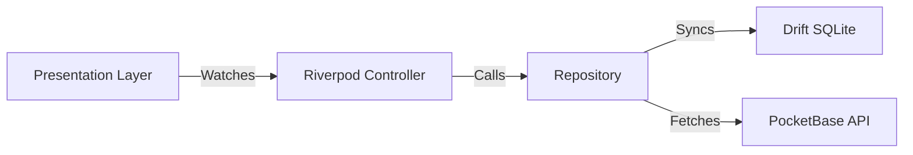

# Saisonier 🇨🇭

> **Der modernste Saisonkalender für die Schweiz.** Visuell, haptisch und radikal saisonal.

<p align="center">
  
  
  
  
</p>

## 🍎 Über das Projekt

Saisonier ist keine langweilige Tabelle. Es ist ein digitales Erlebnis – quasi das **"Tinder für Gemüse"**. Unser Ziel ist es, den saisonalen Einkauf in der Schweiz einfach, sexy und inspirierend zu gestalten.

Die App folgt der Design-Philosophie **"Clean Playfulness"**:
*   **Visuelle Dominanz:** Hochauflösende Bilder stehen im Mittelpunkt.
*   **Haptisches Feedback:** Die App fühlt sich durch subtile Vibrationen "physisch" an.
*   **Schweizer Fokus:** Alle Saison-Daten basieren auf Schweizer Anbaubedingungen (kein EU-Durchschnitt).

## ⭐ Features

### 📱 Seasonal Feed (Inspiration)
Ein immersiver vertikaler Feed ("TikTok Style"), der nur Produkte zeigt, die **jetzt gerade** Saison haben. Perfekt, um sich inspirieren zu lassen, ohne lange suchen zu müssen. Priorisiert werden beliebte Produkte ("Heroes") vor Lagerware.

### 🔍 Katalog Grid (Utility)
Die effiziente Übersicht für den schnellen Check im Supermarkt.
*   **Echtzeit-Suche:** Finde sofort heraus, ob "Wirz" gerade Saison hat.
*   **Intelligente Filter:** Sortiere nach Gemüse, Früchten oder Pilzen.
*   **Out-of-Season Dimming:** Produkte ohne Saison werden visuell dezent in den Hintergrund gerückt.

### 🧑‍🍳 Rezepte & Cooking Mode
Zu jedem Gemüse gibt es kuratierte "3-Zutaten-Rezepte".
*   **Cooking Mode:** Dank "Wakelock" bleibt das Display beim Kochen an.
*   **3D Cards:** Rezeptkarten reagieren auf das Gyroskop des Smartphones.

### ☁️ Sync & Offline First
*   **Guest Mode:** Die App ist sofort nutzbar, ohne Account.
*   **Offline First:** Alle Daten werden aggressiv lokal gespeichert (SQLite). Die App funktioniert auch im Funkloch beim Hofladen.
*   **Cloud Sync:** Wer sich anmeldet (via PocketBase), synchronisiert seine Favoriten über alle Geräte hinweg.

## 🛠 Tech Stack

Saisonier setzt auf modernste Technologien und "Best Practices" der Flutter-Community.

| Bereich | Technologie | Details |
| :--- | :--- | :--- |
| **Frontend** | **Flutter** | Cross-Platform für iOS & Android |
| **State Management** | **Riverpod** | Nutzung von `AsyncNotifier` und Code Generation |
| **Backend** | **PocketBase** | Leichtgewichtiges Go-Backend (Auth & DB) |
| **Database (Local)** | **Drift** | Typsichere SQLite-Integration für Offline-Support |
| **Routing** | **GoRouter** | Deklaratives Routing mit Type-Safe Routes |
| **Code Generation** | **Freezed** | Immutable Data Classes und Unions |

## 🏗 Architektur

Das Projekt folgt einer strikten **Clean Architecture** (Feature-First), um Wartbarkeit und Testbarkeit zu garantieren.



## 🚀 Quick Start

**Voraussetzungen:** Flutter SDK, Android Studio (für Emulator), PocketBase (Backend).

```bash
# 1. Repository klonen
git clone https://github.com/your-user/saisonier.git && cd saisonier

# 2. Abhängigkeiten installieren
flutter pub get

# 3. App starten (startet Emulator automatisch)
./run.sh          # oder: make run
```

### Entwicklungs-Befehle

| Befehl | Beschreibung |
|--------|--------------|
| `./run.sh` | Startet Emulator + App |
| `make run` | Alias für `./run.sh` |
| `make generate` | Code-Generierung (Riverpod/Freezed) |
| `make test` | Tests ausführen |
| `make help` | Alle Befehle anzeigen |

### Emulator konfigurieren

Standardmässig wird `Medium_Phone_API_36.1` verwendet. Für einen anderen Emulator (z.B. Pixel 8 Pro):
```bash
# Einmalig in .bashrc/.zshrc
export SAISONIER_EMULATOR="Pixel_8_Pro"
```

> **Hinweis:** Linux Desktop-Build funktioniert nicht mit Flutter Snap (GLib-Konflikt). Android Emulator verwenden.

## 📄 Lizenz

Dieses Projekt ist als MVP konzipiert. Alle Rechte vorbehalten.

---

*Entwickelt am Zürichsee 🇨🇭*
